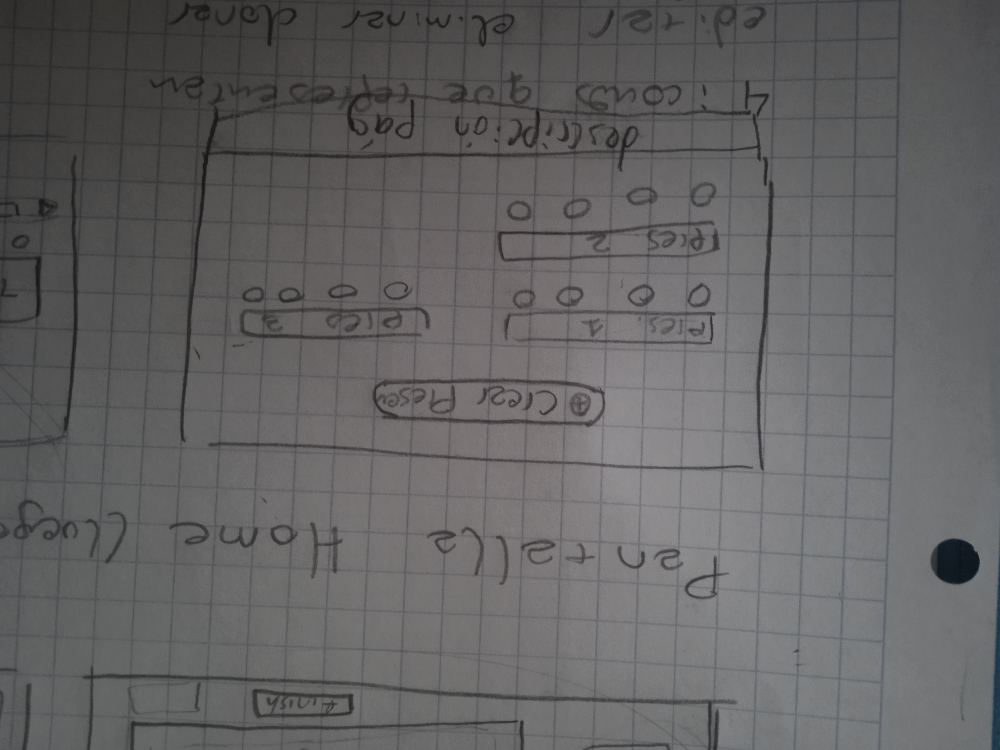
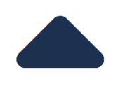
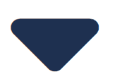
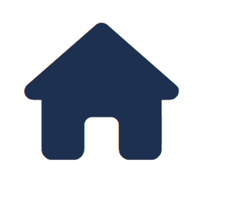
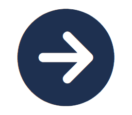

= Memoria del proyecto

=== Introducción
Los miembros del proyecto somos Carmona Hernandez Ferran, Galindo Palacio Joan y Camilo Jumelle. Este proyecto tratará de realizar una aplicación que permitirá a los
 usuarios crear presentaciones. Las presentaciones que se podrán crear contaran con diversos tipos de diapositivas, y el usuario al final podra ver su presentación. 
 El target de esta aplicación serán personas que deseen trasmitir sus conocimientos a otro grupo de personas, y evaluar sus conocimientos. 

=== Seguimiento semanal
// Actualizar cada viernes con descripción y valoración
Semana 1 (9, 10, 11 y del 16 al 21): +
Primeramente hemos definido la guia de estilos de la aplicación, decidimos los colores de la pagina, la tipografia, y hemos elegido varios iconos para la aplicación.
Seguido de ello decidimos la base de datos, haciendo el diagrama y preparamos el vagrant para la bd, luego de poder conectar la bd con exito, nos pusimos a hacer
los sketch y Mockups de las pantallas a realizar. Al completar los Mockups empezamos a crear los html y css de la pantalla home y crear presentacion, además del js 
de crear presentacion. Luego de completar los codigos empezamos a ver como guardar la presentacion al vagrant, mientras lo haciamos descubrimos fallas en el js el cual 
cambiamos según vimos conveniente, aparte de ver tambien fallas en el html y creamos otras pantallas para poder completar la funcionalidad de la aplicación. Luego de conseguir 
guardar las presentaciones correctamente y que el diseño nos parezca aceptable terminamos de realizar la pantalla home con visualización de las presentaciones ya creadas. +

Al empezar el sprint 2 actualizamos el trello, hicimos los sketchs de la pagina editar para luego comenzar a hacer el html y crear la opcion de eliminar. Comenzamos con la pagina editar
y realizamos la opcion de poder cambiar el nombre y la descripción de la presentación, y realizar la funcion de cambiar la posicion del orden(aunque aun esa funcion no se guarda en la bd). +

Semana 2 (23-27)
Se completo la pantalla editar, cambiamos el diseño del reordenamiento, agregamos la funcion de eliminar y modificar las diapositivas. Empezamos a realizar los mockup de 
las previsualizaciones, y los archivos php y js para que estos realicen la funcion. Creamos también los estilos de la previsualización y añadimos la funcion para que esta 
se guarde en la bd y se muestre cada vez que el usuario le da a previsualizar. +
Comenzamos ha configurar la maquina isard en la maquina de Camilo (aun falta poder entrar correctamente). +

Semana 3 (30-3) +
Terminamos unos toques del sprint anterior y comenzamos el tercero. Realizamos las pantallas para crear y editar diapositivas con imagenes, realizzamos las pantalla
vsita cliente, y creamos la funcion de pubklicar pudiendo ejecutarla o no y pudiendo copiar las urls de las que si. También junto a eso hicimos que al momento de crear
la Presentación puedas añadir un pin a está y se le pedira a los clientes en vistacliente para poder acceder a la presentacion. +
Además terminamos de configurar la maquina isard. +

=== Diseño de BD
Link hacia el digrama relacional de la base de dades:  https://drive.google.com/file/d/1HUVLYU9hPKxmyfT6V3yxM_MYT2UfzMvv/view?usp=sharing

=== Sketching y Mockup de interfaces 
Todos los Sketching se encuentraran en la carpeta docs +
La pantalla Home consta de una pantalla con el fondo del color de nuestra palete (azul grisáceo), y en el centro un boton con el icono de añadir más el texto de "Crear Presentación". +
La pantalla Crear Presentación tendra en la parte superior un boton para volver a la anterior pagina, y a su lado inputs donde se podra poner el titulo y la descripción de la presentación. Debajo estará en la parte izquierda
la opción para añadir o una diapositiva con solo el titulo o una con el titulo más el contenido, y a la parte derecha se visualizara la diapositiva actual, esta tendra un input con el titulo solo en caso de elegir esa opción,
o titulo mas contenido.+
Luego de haber creado al menos una Presentación en PantallaCrearPresentacion, al volver a la pantalla Home en está se visualizara las presentaciones creadas hasta dicho momento, esta constara de 
maximo dos columnas con el Titulo de dicha presentación mas 4 botones debajo los cuales serán iconos que representan editas, eliminar, clonar y previsualizar.

image::PantallaHome.jpg[Sketch de la pantalla principal home, width=50%]

image::PantallaCrearPresentacionV2.jpg[Sketch de la pantalla de crear presentación (titulo), width=50%]

image::PantallaCrearPresentacion.jpg[Sketch de la pantalla de crear presentación (titulo y contenido), width=50%]

- Link al figma de las diferentes pantallas: 
* https://www.figma.com/file/L0cwsLQkG8uzz2khb70gTF/Pagina-Home?type=design&node-id=0%3A1&mode=design&t=SLndVBhAVoyvUGdy-1[Mockup Slides]

=== Guia de estilos
La paleta de colores que utilizaremos es un fondo azul grisáceo apagado (#96C5B0), ya que el color azul representa Inteligencia, seriedad y confianza. Mostrando este azul apagado queremos puntuar esta seriedad y consideramos que estos sentimientos que representa se adecuan correctamente a la temática de la aplicación.

image::color.png[Imagen del color utilizado]

El color de texto será negro, puesto que contrasta muy bien con el color de fondo y además muestra elegancia y formalidad. +
El estilo de texto que utilizamos es el Liberation Sans ya que es un texto simple y cómodo de leer para los usuarios, no presenta ninguna dificultad a la hora de la visualización por usuario como pueden presentar otros tipos de texto más editados.

image::liberationSans.png[Imagen del tipo de fuente utilizado]

Los iconos utilizados son del sitio web Font Awesome: https://fontawesome.com/icons +
Iconos utilizados en la aplicación: +

- https://fontawesome.com/icons/circle-plus?f=classic&s=solid[Icono de añadir]

image::add.png[width=80]

- https://fontawesome.com/icons/trash?f=classic&s=solid[Icono de eliminar]

image::delete.png[width=80]

- https://fontawesome.com/icons/pen-to-square?f=classic&s=solid[Icono de editar]

image::edit.png[width=80]

- https://fontawesome.com/icons/eye?f=classic&s=solid[Icono de previsualizar]

image::preview.png[width=80]

- https://fontawesome.com/icons/clone?f=classic&s=solid[Icono de clonar]

image::clonar.png[width=80]

- https://fontawesome.com/icons/palette?f=classic&s=solid[Icono de estilo]

- https://fontawesome.com/icons/sort-up?f=classic&s=solid[Icono de ordenar arriba]

- https://fontawesome.com/icons/sort-down?f=classic&s=solid[Icono de ordenar abajo]

- https://fontawesome.com/icons/link?f=classic&s=solid[Icono de copiar URL]

- https://fontawesome.com/icons/share-from-square?f=classic&s=solid[Icono de publicar]

- https://fontawesome.com/icons/house?f=classic&s=solid[Icono Home]

- https://fontawesome.com/icons/circle-xmark?f=classic&s=solid[Icono de cerrar]

- https://fontawesome.com/icons/circle-arrow-right?f=classic&s=solid[Icono de siguiente]

- https://fontawesome.com/icons/circle-arrow-left?f=classic&s=solid[Icono de anterior]

Link del resumen esquemático de la guía de estilos: https://www.figma.com/file/NLUpqEUNShhgeqQzZvntOe/Guia-d'estils?type=design&node-id=0%3A1&mode=design&t=Qni8KE80LLjWfZ9U-1[Guía de estilos (figma)]

=== Confección del manual de instalación/distribución de la aplicación
instalación del servidor: +
- php (extension pdo_mysql)
- mysql 
- GIT
Luego de instalarlos correctamente podrá configurar la ip, el nombre de la bd, el usuario y password en codigo/controllers/config.php. +
Para obtener la última version disponible de Slides abra el CMD o terminal y ubiquese en la carpeta del repositorio GIT 
 slidescarmonagalindojumelle, desde ahí ingrese: + 
  +
$ git pull  +
  +
Al darle enter vera como se descarga o actualizan los archivos requeridos para la aplicación. O si tiene ya la última version disponible 
le saldra un mensaje diciendo 'Already up to date'. +

=== Confección del manual de usuario integrado en la aplicación
==== Crear Presentación
Al entrar a la aplicación de slides, si es la primera vez que entra tan solo verá un boton azul el cual dice 'Crear una nueva presentación'
entre ahi y podrá comenzar a crear presentaciones. +
Una vez en la pagina de crear presentacion debemos de indicar el nombre y una breve descripción de la presentacion, tenga en cuenta que el 
límite de el titulo de la presentacion es de 25 cáracteres. También tiene la opción de ponerle un pin a su presentacion este pin se verá solo
para las personas con las que comparta la presentacion una vez publicada. Si no coloca un pin podrá publicarla sin restrincción de quien entre 
a su presentación. +

==== Creacion de las Diapositivas
Al crearla por unos tres segundos se verá un mensaje verde donde nos indicará que la presentacion se ha creado con éxito y ya podemos comenzarar
a crear las diapositivas de nuestra presentación. Podemos observar en la parte superior un boton para volver a la pantalla inicial, el titulo de 
nuestra presentación y un boton para previsualizar nuestra presentacion a medida que la creemos. +
Para crear diapositivas veremos en la parte del centro de nuestra pantalla un cuadro donde podremos escribir el titulo y debajo el botón de 
añadir diapositiva. Si usted desea crear una diapositiva con titulo y un contenido debajo en la parte de la derecha veras 3 botones, clickando 
en el segundo cambiará el formato de la diapositiva, si querés solo con titulo presiona 'titulo', si deseas un titulo y un texto presiona 
'contenido' y si ademas del titulo y texto deseas colocar una imagen presiona 'imagen'. En la version imagen solo podrás añadir una imagen con 
un limite de 2MB presionando en 'Seleccionar archivo'. +

// Añadir pestaña de preguntas

Si usted ya escribio algo en la diapositiva y quiere saber como se vería en la visualización de la presentación puede ver un boton de un ojo en 
la derecha donde esta escribiendo la diapositiva, presionelo y se verá con el estilo default (Podrá cambiar el estilo más adelante). +
Mientras está diseñando la presentacion podra notar que cada diapositiva añadida se ira viendo en la parte izquierda con unos botones a su lado 
con estos botones podrá ir reordenando la presentación a su gusto. También puede volver a observar (pero no editar) cada diapositiva haciendo 
click en el titulo de está. +

==== Más funciones 
Una vez que a terminado con esta presentacion puede dirigirse a la página principal con el boton de la izquierda superior que dice 'Home'. +
Acá podrá ver las presentaciones creadas hasta el momento, se verá el titulo de dicha presentación más varios botones. +

===== Editar presentación
El primer boton (iniciando por la izquierda) es el botón para editar la presentacion, al precionarlo podrá volver a ver la presentacion como 
en el momento en el que estaba creandola más unas funciones extras. Arriba debajo del titulo se añadieron 4 botones extras para personalizar 
aún más su presentacion, comenzando por la izquierda tenemos modificar estilos, en esta pantalla podemos elegir el tema que más nos guste 
para nuestra presentación, a su lado esta el boton para editar la presentacion acá podremos editar el titulo y descripción de la presentacion,
despues tenemos el botón de publicaar presentacion para que otros vean su presentacion (la persona con la que la comparta no podrá editar su 
presentación) y copiar url, el copiar url solo podrá usarse una vez que la presentacion sea publica. +
Además de estas 4 funciones también se verán unos botones a la derecha de los botones para reordenar las diapositivas, el cual nos permitirá 
eliminar las diapositivas. +

===== Eliminar presentación
Devuelta a la página Home, tenemos después del  botón de editar esta el botón de eliminar por completo la presentación dando click veremos un 
mensaje para confirmar y aceptando ya no se verá la presentación. +

===== Clonar presentación (no funcional)
El siguiente botón es el de clonar y este por el momento no creara una presentación adicional ni nos llevara a otra página. +

===== Vizualizar presentación
Después veremos otra vez el botón del ojo, que al igual que en crear o editar las presentaciones este también nos permite previsualizar la 
presentación completa con el tema que hayamos elegido en editar presentación. +

===== Publicar presentación
Y por último tenemos los botones que tambien vemos en editar presentación, los cuales nos permitiran publicar o despublicar la presentación 
(veremos si la presentacion ya esta publicada si su color es verde, si es gris aún no ha sido publicada), y a su lado tenemos el botón para poder 
copiar la url de la presentación compartida. +
 +
Ya con toda esta información usted ya será capaz de crear una increibles presentaciones. 

=== Linias futuras

=== Concluciones 

=== Glosario

=== Presentación del proyecto
