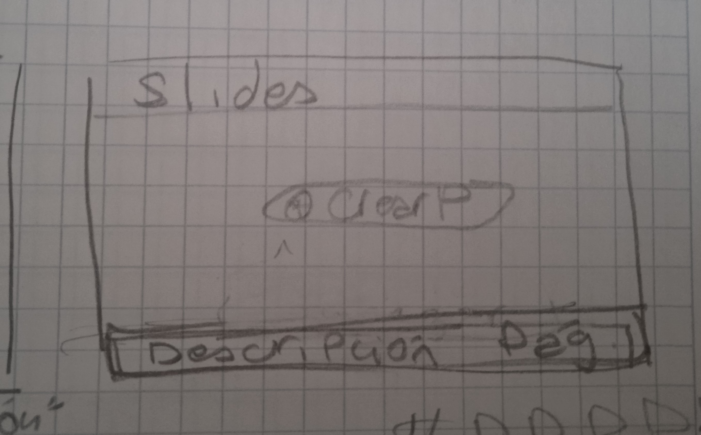
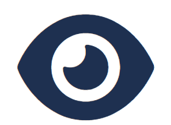

= Memoria del proyecto

=== Introducción
Los miembros del proyecto somos Carmona Hernandez Ferran, Galindo Palacio Joan y Camilo Jumelle. Este proyecto tratará de realizar una aplicación que permitirá a los usuarios crear presentaciones. Las presentaciones que se podrán crear contaran con diversos tipos de diapositivas, y el usuario al final podra ver su presentación. El target de esta aplicación serán personas que deseen trasmitir sus conocimientos a otro grupo de personas, y evaluar sus conocimientos. 

=== Seguimiento semanal
// Actualizar cada viernes con descripción y valoración

=== Diseño de BD
Link hacia el digrama relacional de la base de dades:  https://drive.google.com/file/d/1HUVLYU9hPKxmyfT6V3yxM_MYT2UfzMvv/view?usp=sharing

=== Sketching y Mockup de interfaces 
Todos los Sketching se encuentraran en la carpeta docs +
La pantalla Home consta de una pantalla con el fondo del color de nuestra palete (azul grisáceo), y en el centro un boton con el icono de añadir más el texto de "Crear Presentación". +
La pantalla Crear Presentación tendra en la parte superior un boton para volver a la anterior pagina, y a su lado inputs donde se podra poner el titulo y la descripción de la presentación. Debajo estará en la parte izquierda
la opción para añadir o una diapositiva con solo el titulo o una con el titulo más el contenido, y a la parte derecha se visualizara la diapositiva actual, esta tendra un input con el titulo solo en caso de elegir esa opción,
o titulo mas contenido. Si se elige solo titulo la diapositiva se vera como en la foto PantallaCrearDiapositiva.jpg, sino se verá como en PantallaCrearDiapositivaV2.jpg. +

image::PantallaCrearPresentacionV2.jpg[Sketch de la pantalla de crear presentación (titulo), width=50%]

image::PantallaCrearPresentacion.jpg[Sketch de la pantalla de crear presentación (titulo y contenido), width=50%]

- Link al figma de las diferentes pantallas: 
* https://www.figma.com/file/L0cwsLQkG8uzz2khb70gTF/Pagina-Home?type=design&node-id=0%3A1&mode=design&t=SLndVBhAVoyvUGdy-1[Mockup Slides]

=== Guia de estilos
La paleta de colores que utilizaremos es un fondo azul grisáceo apagado (#96C5B0), ya que el color azul representa Inteligencia, seriedad y confianza. Mostrando este azul apagado queremos puntuar esta seriedad y consideramos que estos sentimientos que representa se adecuan correctamente a la temática de la aplicación.

image::color.png[Imagen del color utilizado]

El color de texto será negro, puesto que contrasta muy bien con el color de fondo y además muestra elegancia y formalidad. +
El estilo de texto que utilizamos es el Liberation Sans ya que es un texto simple y cómodo de leer para los usuarios, no presenta ninguna dificultad a la hora de la visualización por usuario como pueden presentar otros tipos de texto más editados.

image::liberationSans.png[Imagen del tipo de fuente utilizado]

Los iconos utilizados son del sitio web Font Awesome: https://fontawesome.com/icons +
Iconos utilizados en la aplicación: +

- https://fontawesome.com/icons/circle-plus?f=classic&s=solid[Icono de añadir]

- https://fontawesome.com/icons/trash?f=classic&s=solid[Icono de eliminar]

image::delete.png[width=80]

- https://fontawesome.com/icons/pen-to-square?f=classic&s=solid[Icono de editar]

image::edit.png[width=80]

- https://fontawesome.com/icons/magnifying-glass?f=classic&s=solid[Icono de previsualizar]

- https://fontawesome.com/icons/clone?f=classic&s=solid[Icono de clonar]

Link del resumen esquemático de la guía de estilos: https://www.figma.com/file/NLUpqEUNShhgeqQzZvntOe/Guia-d'estils?type=design&node-id=0%3A1&mode=design&t=Qni8KE80LLjWfZ9U-1[Guía de estilos (figma)]

=== Confección del manual de instalación/distribución de la aplicación

=== Confección del manual de usuario integrado en la aplicación

=== Linias futuras

=== Concluciones 

=== Glosario

=== Presentación del proyecto
